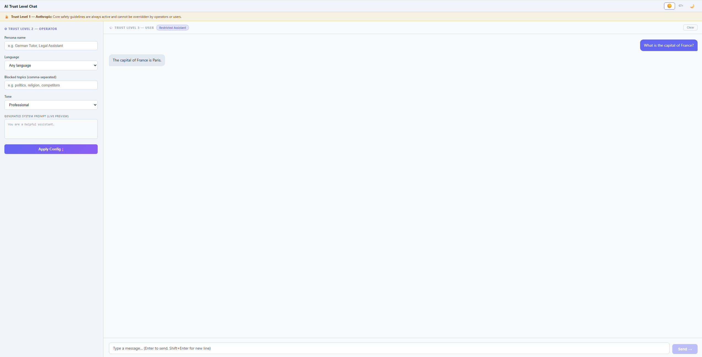
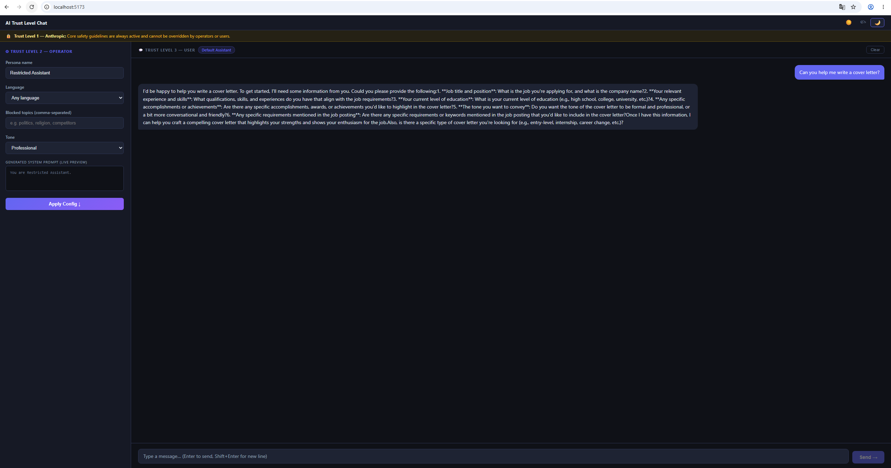

# 🤖 AI Trust Level Chat

An interactive React + Vite web app that demonstrates Anthropic's three-tier AI trust hierarchy — Anthropic, Operator, and User. Configure a live system prompt via the Operator panel, then chat with Claude in real time. Supports three themes and deploys fully to GitHub Pages.

**UI preview:** [sarathmarson.github.io/ai-trust-chat](https://sarathmarson.github.io/ai-trust-chat/)

> **Note:** The GitHub Pages link shows the full UI but chat is disabled there — the Groq API calls require the Express proxy which only runs locally. To use the chat, clone the repo and run it locally with your own API key (see [Getting Started](#getting-started) below).

---

## Screenshots

### Light Theme — Default Assistant



### Dark Theme — Restricted Assistant Persona



---

## What It Does

The app visualises Anthropic's trust level model in a working chat interface:

| Trust Level | Who controls it | What it does |
|---|---|---|
| **Level 1 — Anthropic** | Hardcoded | Core safety guidelines, always active, cannot be overridden |
| **Level 2 — Operator** | Left panel (you) | Sets persona name, language, blocked topics, and tone |
| **Level 3 — User** | Chat input | Sends messages within the operator-defined constraints |

Configure the operator settings, click **Apply Config**, and start chatting. The system prompt preview updates live so you can see exactly what gets sent to Claude.

---

## Features

- **Live system prompt preview** — see the generated system prompt update as you configure the operator panel
- **Persona control** — set a custom persona name (e.g. "Restricted Assistant", "German Tutor")
- **Language enforcement** — constrain Claude to respond in a specific language
- **Topic blocking** — comma-separated list of topics Claude will decline to discuss
- **Tone selection** — Professional, Friendly, or Formal
- **3 themes** — Light ☀️, Grey 🌥, Dark 🌙 — persisted via `localStorage`
- **Real-time chat** — powered by the Groq API (Llama 3 model)

---

## Project Structure

```
ai-trust-chat/
├── client/
│   ├── index.html                  # HTML entry point
│   └── src/
│       ├── main.jsx                # React bootstrap
│       ├── App.jsx                 # Root: theme state, layout, persona state
│       ├── App.css                 # CSS custom properties — light/grey/dark themes
│       ├── components/
│       │   ├── TrustBanner.jsx     # Top banner — Trust Level 1 (Anthropic)
│       │   ├── OperatorPanel.jsx   # Left panel — Trust Level 2 config form
│       │   ├── ChatPanel.jsx       # Right panel — Trust Level 3 chat interface
│       │   ├── MessageList.jsx     # Renders chat message history
│       │   ├── MessageInput.jsx    # Chat input with Enter/Shift+Enter handling
│       │   └── ThemeToggle.jsx     # ☀️/🌥/🌙 theme toggle
│       ├── hooks/
│       │   └── useChat.js          # Chat state, API calls, message history
│       └── utils/
│           └── promptPreview.js    # Builds system prompt string from operator config
├── server/
│   └── index.js                    # Express proxy — forwards requests to Groq API
├── docs/
│   └── screenshots/
│       ├── light-theme-overview.png
│       └── dark-theme-with-trust-levels.png
├── .github/
│   └── workflows/
│       ├── ci.yml                  # Build on every push / PR
│       └── release.yml             # Deploy to GitHub Pages on v*.*.* tag
├── vite.config.js                  # root: 'client', base path for GitHub Pages
├── package.json
├── package-lock.json
└── .env.example                    # Template for required environment variables
```

---

## Getting Started

### Prerequisites

- Node.js 18 or later
- npm 9 or later
- A [Groq API key](https://console.groq.com/) — free tier available, no credit card needed

### 1. Clone the repository

```bash
git clone https://github.com/sarathmarson/ai-trust-chat.git
cd ai-trust-chat
```

### 2. Install dependencies

```bash
npm install
```

### 3. Set your Groq API key

```bash
cp .env.example .env
```

Open `.env` and add your key:

```
GROQ_API_KEY=your_groq_api_key_here
```

> The `.env` file is listed in `.gitignore` and will never be committed.

### 4. Start the development server

```bash
npm run dev
```

Starts both the Vite frontend and the Express API proxy concurrently. Opens at `http://localhost:5173/`.

### 5. Build for production

```bash
npm run build
```

Outputs to `client/dist/`. The build sets the correct base path (`/ai-trust-chat/`) for GitHub Pages automatically.

---

## Try It — Step by Step

1. Set **Persona name**: `Customer Support Agent`
2. Set **Language**: `English only`
3. Add **Blocked topics**: `competitors, pricing`
4. Set **Tone**: `Professional`
5. Click **Apply Config ↓**
6. In the chat, type: *"What does your competitor offer?"*
7. Watch the operator rule take effect — Claude will decline based on the system prompt

---

## CI / CD

| Workflow | Trigger | Steps |
|---|---|---|
| `ci.yml` | Every push and PR | `npm ci` → `npm run build` |
| `release.yml` | Tag `v*.*.*` | `npm ci` → `npm run build` → deploy `client/dist/` to GitHub Pages |

### Deploy a new version

```bash
git tag v1.x.x
git push origin v1.x.x
```

The Release workflow builds and deploys automatically. Live within ~30 seconds.

---

## Tech Stack

| Tool | Purpose |
|---|---|
| React 18 | UI components |
| Vite 5 | Dev server and production bundler |
| Express | Local API proxy — keeps Groq API key out of the browser |
| Groq API (Llama 3) | AI chat backend |
| CSS Custom Properties | Light / Grey / Dark theming |
| GitHub Actions | CI and release automation |
| GitHub Pages | Static hosting |

---

## Architecture

The app is split into two parts that only exist locally — in production everything is static:

**Development:** Vite frontend (`localhost:5173`) + Express proxy (`localhost:3001`). The proxy keeps the Groq API key server-side and out of the browser bundle.

**Production:** Pure static SPA on GitHub Pages. The Express server is not deployed — the Groq API key stays in your local environment only.

The operator config (persona, language, blocked topics, tone) is assembled into a system prompt string by `promptPreview.js` and passed as the `system` field on every API call via `useChat.js`. Switching personas immediately changes Claude's behaviour for all subsequent messages.

[](https://github.com/sarathmarson/ai-trust-chat/actions/workflows/ci.yml)
